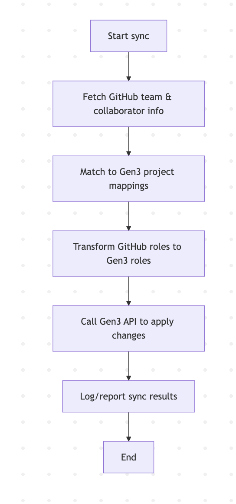

# Overview `git-sync`

Contents:

* A **high-level architecture for the `git-sync` project**, where **GitHub,etc. becomes the source of truth (system of record)** for project roles, replacing Synapse. The target system remains **Gen3**, where roles and access need to be synchronized.
* Support for **GitLab** or **other Git servers**, we introduce an **abstraction layer** for the identity and role retrieval logic. This layer separates the **source system** (GitHub, GitLab, etc.) from the **target system** (Gen3), making the architecture **extensible and pluggable**.
* **Unit and integration test specifications** for the `git-sync` project with pluggable Git-based role sources and Gen3 as the target system.

---

## 🎯 Goal

> **Sync project role assignments from GitHub teams and collaborators to Gen3's access control system**.

---

## 🧭 Conceptual Overview

```text
     +---------------------+
     |     GitHub Org      | <-- system of record
     | - Teams             |
     | - Collaborators     |
     +---------+-----------+
               |
               | REST API
               v
     +---------------------+        +---------------------+
     |    git-sync CLI   +------>+   Gen3 Access API   |
     | - Fetch & map roles  |        | - Projects & ACLs  |
     | - Transform to Gen3  |        | - Policies          |
     +---------------------+        +---------------------+
```

---

## 🧱 Architectural Components

### 1. **GitHub as the System of Record**

- **Source of role info**:
  - [Organization Teams](https://docs.github.com/en/organizations/collaborating-with-groups-in-your-organization/about-teams)
    - Represent Gen3 "project roles" (e.g., `project-admins`, `project-members`)
  - [Repository Collaborators](https://docs.github.com/en/rest/collaborators/collaborators?apiVersion=2022-11-28)
    - Fallback or direct per-project access info

- **API Use**:
  - List team members
  - Map team slugs to Gen3 projects/roles
  - Fetch repo collaborators and permission levels (`pull`, `push`, `admin`)

---

### 2. **git-sync CLI Service**

A command-line tool/service that:

- Authenticates with GitHub and Gen3
- Loads configuration mapping GitHub entities to Gen3 projects and roles
- Periodically or on-demand performs synchronization

#### Functions:

| Function                     | Description |
|-----------------------------|-------------|
| `fetch_github_teams()`      | Get org teams, members, and slugs |
| `map_to_gen3_roles()`       | Transform GitHub teams → Gen3 roles |
| `fetch_repo_collaborators()`| Identify individual users & access |
| `sync_to_gen3()`            | Write roles to Gen3 using `fence` API |

---

### 3. **Configuration Layer**

Example YAML mapping:

```yaml
projects:
  project-xyz:
    github_teams:
      - aced-project-xyz-admins: project-admin
      - aced-project-xyz-members: project-member
    repos:
      - aced/project-xyz
```

---

### 4. **Target System: Gen3 (Fence Authz)**

- **API Integration**:
  - Use Gen3/fence endpoint: `PUT /user` or `PATCH /access` for roles
- **Mapped Roles**:
  - `project-admin`
  - `project-member`
  - `data-submitter`

---

## 🔒 Security & Auth

- **GitHub Auth**:
  - Use GitHub App or PAT with `read:org` and `repo` scopes
- **Gen3 Auth**:
  - Use API key or JWT token authorized to manage users

---

## 📋 Sync Flow


---

## 🚀 Future Enhancements

- Bi-directional diff reporting (GitHub vs Gen3)
- Dry-run and audit modes
- GitHub webhooks for near-real-time sync
- GitHub Actions-based CI for automation
- Slack/email alerts for sync failures

---


## 🧱 High-Level Architecture with Abstraction Layer
To enable support for **GitLab** or **other Git servers**, we introduce an **abstraction layer** for the identity and role retrieval logic. This layer separates the **source system** (GitHub, GitLab, etc.) from the **target system** (Gen3), making the architecture **extensible and pluggable**.


```text
     +---------------------+        +---------------------+        +----------------------+
     |     GitHub / GitLab |        |     Bitbucket etc.  |        |   Other Identity     |
     |   (source plugins)  |        |   (optional source) |        |     Providers        |
     +----------+----------+        +----------+----------+        +----------+-----------+
                |                            |                              |
                |                            |                              |
                +------------+---------------+------------------------------+
                             |
                             v
        +-----------------------------------------------+
        |      RoleSourceAdapter Interface (Abstract)   |
        | - get_users_for_project(project_id)           |
        | - get_teams_for_project(project_id)           |
        | - get_user_roles()                            |
        +-----------------------------------------------+
                             |
             +---------------+-----------------+
             |                                 |
     +-------v--------+               +--------v--------+
     | GitHubAdapter  |               | GitLabAdapter   |  ← add more: BitbucketAdapter, etc.
     +----------------+               +-----------------+

                             |
                             v
            +--------------------------------------+
            |        git-sync Core Logic        |
            | - Loads config & adapter             |
            | - Maps source roles to Gen3 roles    |
            | - Pushes to Gen3 via Gen3 API        |
            +--------------------------------------+
                             |
                             v
                  +------------------------+
                  |      Gen3 API (Fence)  |
                  +------------------------+
```

---

## 🧩 Interface Definition: `RoleSourceAdapter`

```python
from typing import List, Dict

class RoleSourceAdapter:
    def get_users_for_project(self, project_id: str) -> List[str]:
        raise NotImplementedError

    def get_teams_for_project(self, project_id: str) -> Dict[str, List[str]]:
        raise NotImplementedError

    def get_user_roles(self) -> Dict[str, str]:
        """Optional: direct user-to-role mapping"""
        raise NotImplementedError
```

---

## 🔌 GitHub Adapter Example

```python
class GitHubAdapter(RoleSourceAdapter):
    def __init__(self, github_token: str, org: str):
        self.token = github_token
        self.org = org

    def get_teams_for_project(self, project_id):
        # use GitHub REST API to get team memberships
        return {
            "aced-project-xyz-admins": ["alice", "bob"],
            "aced-project-xyz-members": ["carol", "dave"]
        }

    def get_user_roles(self):
        # flatten and map to Gen3 roles
        return {
            "alice": "project-admin",
            "carol": "project-member"
        }
```

---

## 🔌 GitLab Adapter Example (Stub)

```python
class GitLabAdapter(RoleSourceAdapter):
    def __init__(self, token: str, group_id: str):
        self.token = token
        self.group_id = group_id

    def get_teams_for_project(self, project_id):
        # use GitLab group and project member APIs
        pass

    def get_user_roles(self):
        # similar mapping logic
        pass
```

---

## 🛠 CLI Usage Example

```bash
# In config.yaml
source:
  type: github
  org: aced
  token_env: GITHUB_TOKEN

# Could also be:
# type: gitlab
# group: aced-projects
# token_env: GITLAB_TOKEN
```

The CLI would dynamically load the adapter based on the `type`.

---

## ✅ Benefits of This Design

| Benefit                  | Description |
|--------------------------|-------------|
| 🔌 **Extensible**         | Easily add new providers (GitHub, GitLab, Bitbucket, etc.) |
| 🔄 **Pluggable**          | Source logic swappable without changing Gen3 sync logic |
| 🔒 **Encapsulated Auth**  | Each adapter handles its own tokens/API nuances |
| 🧪 **Testable**           | Adapters are unit-testable in isolation |

---

## ✅ **Unit Test Specifications**
**Unit and integration test specifications** for the `git-sync` project with pluggable Git-based role sources and Gen3 as the target system.

### 🔧 1. **Adapter Interface Compliance**
Test that all adapter classes correctly implement the `RoleSourceAdapter` interface.

- `test_github_adapter_implements_interface()`
- `test_gitlab_adapter_implements_interface()`

### 🧪 2. **GitHubAdapter**
- Mock GitHub API responses using `requests-mock` or `unittest.mock`
- Tests:
  - `test_get_teams_for_project_returns_expected_structure()`
  - `test_get_user_roles_maps_correct_roles()`
  - `test_handles_empty_team_membership_gracefully()`

### 🧪 3. **GitLabAdapter**
- Stubbed or mocked API interactions
- Tests:
  - `test_get_users_from_gitlab_group()`
  - `test_role_mapping_with_gitlab_permissions()`

### 🧪 4. **Core Logic**
- Tests for transformation and mapping:
  - `test_map_team_to_gen3_role()`
  - `test_generate_patch_payload_for_gen3()`
  - `test_detect_added_and_removed_users()`

### 🧪 5. **Config Loader**
- Validate schema and default fallbacks:
  - `test_config_validates_required_fields()`
  - `test_loads_correct_adapter_from_type()`

### 🧪 6. **CLI Command**
Use `click.testing.CliRunner`:
- `test_sync_command_runs_with_github_config()`
- `test_invalid_config_returns_error()`

---

## 🔁 **Integration Test Specifications**

### 🌐 1. **Mock GitHub + Gen3**
Set up mocks or test containers for GitHub API and Gen3 Fence.

- Use `responses` or `httpx_mock` for mocking GitHub/Gen3 endpoints
- Tests:
  - `test_full_sync_applies_roles_to_gen3()`
  - `test_users_removed_from_github_are_removed_from_gen3()`
  - `test_users_added_to_team_are_reflected_in_gen3()`

### 🔁 2. **End-to-End Sync Flow**
- Fixture:
  - `config.yaml`
  - Mocked GitHub API for team memberships
  - Mocked Gen3 `/user` and `/access` endpoints
- Validate:
  - API calls are made
  - Correct role updates are sent
  - Logging and reporting capture expected output

### 🔒 3. **Security Edge Cases**
- Token expiration
- Invalid org/repo
- Permissions mismatch
- Tests:
  - `test_invalid_github_token_raises_error()`
  - `test_gen3_rejects_unauthorized_user_changes()`

---

## 📁 Suggested Test Directory Structure

```
tests/
├── unit/
│   ├── test_github_adapter.py
│   ├── test_gitlab_adapter.py
│   ├── test_core_logic.py
│   └── test_config_loader.py
├── integration/
│   ├── test_end_to_end_github_sync.py
│   ├── test_error_handling.py
│   └── test_gen3_interactions.py
└── fixtures/
    └── github_team_response.json
```

---

## ✅ Tools & Fixtures

| Tool            | Purpose                           |
|-----------------|-----------------------------------|
| `pytest`        | Core testing framework            |
| `responses`     | HTTP mocking for REST APIs        |
| `click.testing` | CLI command testing               |
| `pydantic`      | Config schema validation          |
| `tox` or `nox`  | Multi-environment test automation |

---

