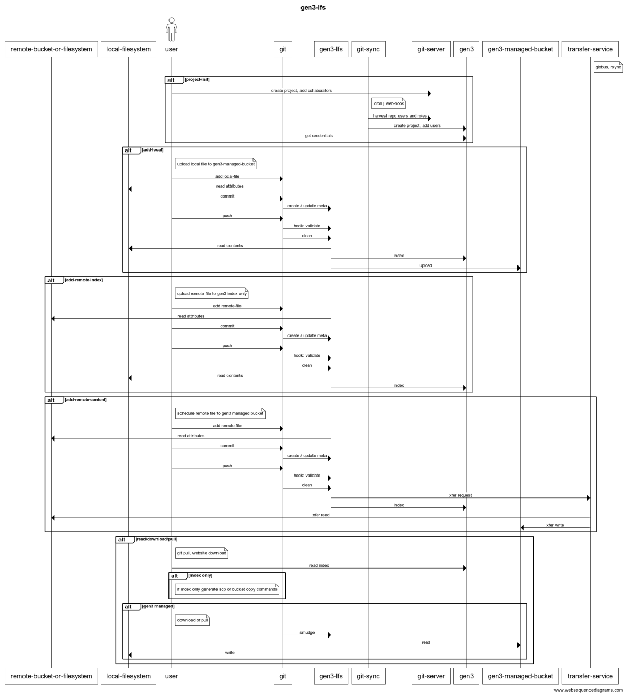

# Documentation Index

Welcome to the `git-gen3` documentation! Below is an index of the available documentation files in this directory.

---
## Overview

Based on the current structure of the ACED Integrated Data Platform (IDP), which utilizes the `g3t` command-line tool for project creation, file uploads, and metadata association citeturn0search0, it's advisable to refactor this monolithic approach into modular utilities. This will enhance maintainability, scalability, and facilitate targeted enhancements.

---

## 🧱 Proposed Modular Architecture
Transitioning to a modular architecture involves decomposing the monolith into distinct utilities, each responsible for a specific domain

### 1. **Project Management Utility**

**Responsibilities:**
-Initialize and manage project structures
-Handle user roles and permissions
-Integrate with git servers for audit trails project membership

**Implementation Suggestions:**
-Develop a CLI tool, e.g., `auth-sync`, to manage project lifecycles
-Utilize configuration files (YAML/JSON) to define project metadata
-Integrate with Git for version control and collaboration

### 2. **File Transfer Utility**

**Responsibilities:**
-Handle uploading and downloading of data files
-Support resumable transfers and integrity checks
-Manage storage backend interactions (e.g., S3, GCS)

**Implementation Suggestions:**
-Create a tools, e.g., `git-lfs extentions, git add/pull url`, to abstract file operations
-Incorporate support for various storage backends using plugins or adapters
-Implement checksum verification to ensure data integrity

### 3. **Metadata Management Utility**

**Responsibilities:**
-Facilitate the creation, validation, and submission of metadata
-Transform metadata into required formats (e.g., FHIR resources)
-Ensure compliance with data standards and schemas

**Implementation Suggestions:**
-Develop a utility, e.g., `git meta init/validate/etc`, to manage metadata workflows
-Leverage existing tools like `g3t_etl` for data transformation 
-Incorporate schema validation to enforce data quality

---

## 🔄 Integration Strategy

To ensure seamless operation between these utilities:

* Establish a shared configuration system to maintain consistency across tool.
* Provide comprehensive documentation and user guides to facilitate adoption.

---

## 🛠️ Implementation Roadmap

1. **Assessment Phase:**
  - Evaluate the current monolithic system to identify components for extraction.
  - Prioritize functionalities based on user needs and system dependencies.

2. **Development Phase:**
  - Iteratively develop and test each utility.
  - Ensure backward compatibility where necessary.

3. **Deployment Phase:**
  - Roll out utilities to a subset of users for feedback.
  - Monitor performance and gather user input for refinements.

4. **Documentation and Training:**
  - Update documentation to reflect the new modular structure.
  - Conduct training sessions to familiarize users with the new tools.

## 📚 Documentation Files 

The following files provide **very rough, draft** information about the `git-gen3` project, its architecture, and its components:

1. [README-comparison](README-comparison.md)
   - A comparison of the `lfs-meta` tool with other tools and approaches.
   - Discusses the advantages and disadvantages of each approach.
   - Provides a summary of the key features and capabilities of `lfs-meta`.
2. [Epics and Sprint Plan](README-epic.md)
   - Overview of project goals, sprint breakdowns, and deliverables.
3. [Auth-sync](README-git-sync.md)
   - Details on how to sync authentication and authorization with github/synpase/etc as the system of record for project membership.
4. [Git LFS project archetype](README-gitlfs-template-project.md)
    - Exemplar user project structure
5. [Git LFS Metadata](README-gitlfs-meta.md)
    - Information on how to manage metadata for large files in Git.
6. [Git LFS Remote Buckets](README-gitlfs-remote-buckets.md)
    - Details for tracking remote files without downloading them.
7. [Release Testing](README-release-test.md)
    - Guidelines for testing the release process and ensuring functionality.

## Overview
