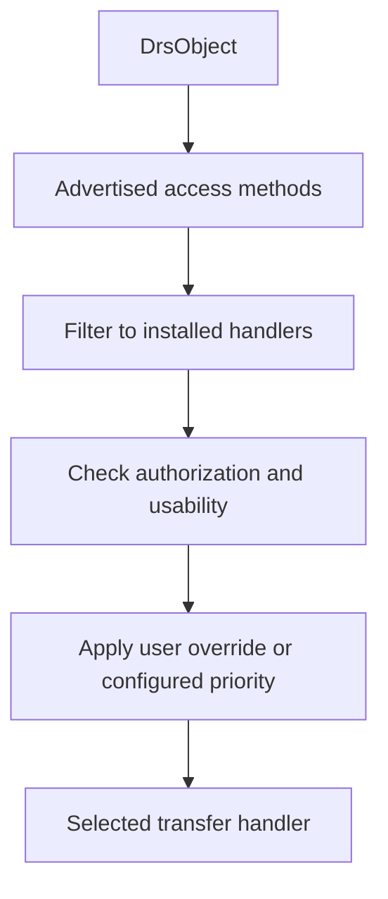
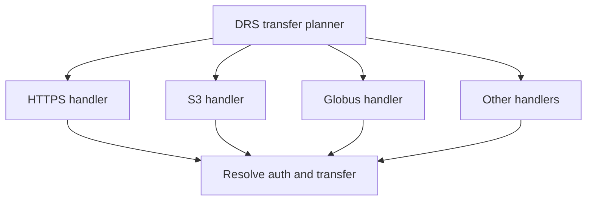
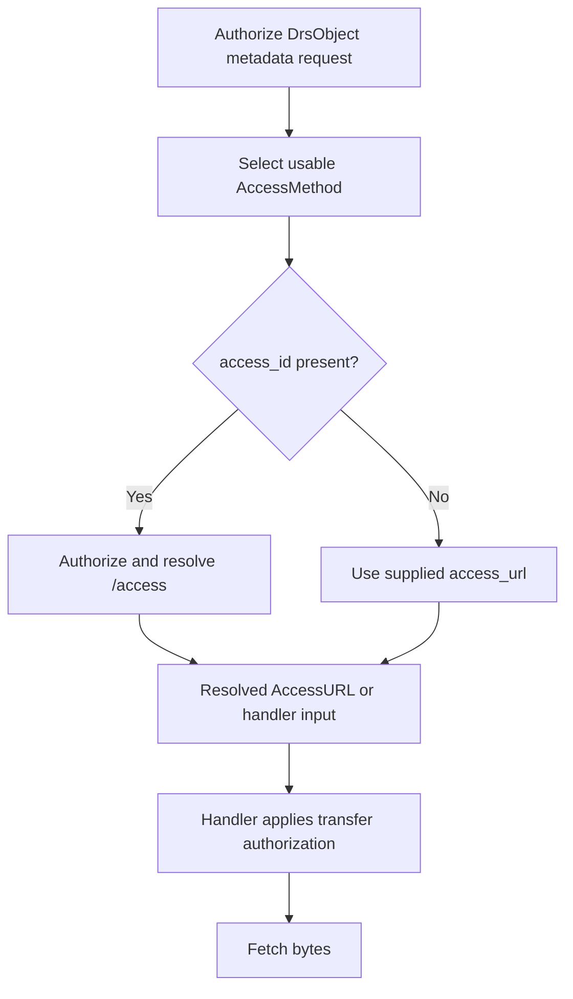
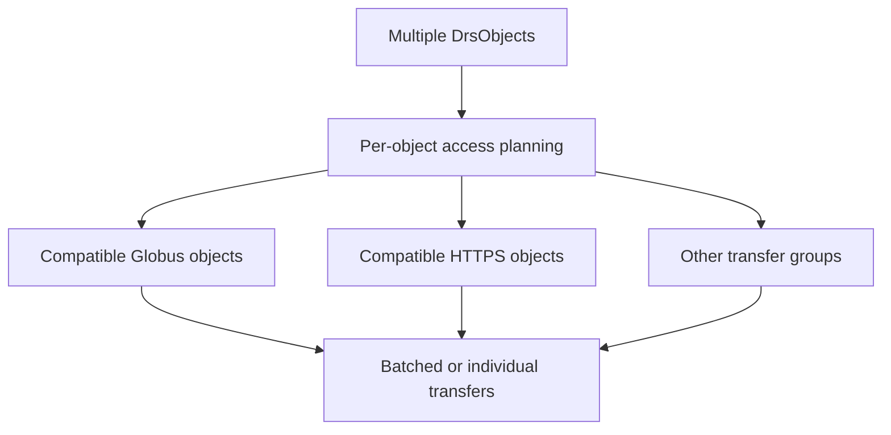

# ADR: DRS Access Method Selection and Authentication

- **Status:** Proposed
- **Date:** 2026-08-05
- **Decision owners:** git-drs maintainers
- **Scope:** Selection, authentication, and batching of DRS access methods, including Globus

## Context

The GA4GH Data Repository Service (DRS) allows a `DrsObject` to advertise one or more `access_methods`. A client such as git-drs may therefore encounter both:

1. a single `DrsObject` with several possible access methods, such as `https`, `s3`, and `globus`; and
2. a collection of `DrsObject` values whose available access methods and authorization requirements differ from object to object.

DRS does not define a priority among access method types. An access method `type` identifies how the bytes can be transferred; it does **not** uniquely identify how the transfer must be authenticated.

For example, an `s3` access method may represent a public object, use locally available AWS credentials, resolve to a signed URL, or require information returned with the access URL. Likewise, selecting `globus` identifies the transfer mechanism but does not, by itself, define how the client obtains a Globus identity or token.

DRS also separates authorization into distinct interactions:

| Interaction | DRS mechanism |
| --- | --- |
| Retrieve `DrsObject` metadata | Authorization discovery for the object endpoint, including `OPTIONS /objects/{object_id}` |
| Resolve an `access_id` | `AccessMethod.authorizations` describes authorization for the `/access` request |
| Fetch the bytes | `AccessURL.headers`, a signed URL, public access, or credentials understood by the selected transfer implementation |

Consequently, git-drs cannot reliably choose authentication merely by mapping a DRS access method type to a credential type.

## Decision

git-drs will treat **access-method selection** and **authentication** as related but separate decisions.

For every `DrsObject`, git-drs will:

1. inspect the access methods advertised by DRS;
2. discard methods for which no installed transfer handler exists;
3. ask each remaining handler whether the access method can be resolved and its authorization requirements can be satisfied;
4. select the highest-priority usable method according to client configuration; and
5. allow the user to override automatic selection explicitly.

Each transfer handler owns the protocol-specific logic needed to resolve and execute its transfer. Authentication is determined from the DRS authorization information and the selected handler's capabilities, not inferred solely from `AccessMethod.type`.



### Transfer handler model

git-drs will expose protocol-specific handlers behind a common transfer interface. Initial handlers may include HTTPS, S3, Google Storage, and Globus.



The handler contract should answer, at minimum:

- whether it supports a given `AccessMethod`;
- whether the access method can be resolved with the available authorization context;
- whether the resulting transfer can be performed in the current environment; and
- how the transfer should be executed or batched.

### Selection policy

DRS defines no preferred ordering, so git-drs will provide a configurable client-side priority. For example:

```yaml
access_method_priority:
  - globus
  - s3
  - gs
  - https
```

An explicit command-line option or `GIT_DRS_ACCESS_METHOD` preference will override the configured order when the requested method is available and usable:

```bash
git drs pull --access-method globus
```

The preference is evaluated per object. If an object does not advertise the
preferred method, or that method is unusable, git-drs selects the next usable
method for that object. This fallback allows one pull to combine Globus and
non-Globus transfers. A strict, collection-wide transport requirement is not
part of this option.

The exact default priority is an implementation/configuration choice and is intentionally not part of the DRS interpretation in this ADR.

### Authentication policy

git-drs will **not** implement a fixed mapping such as:

```text
s3     -> AWS authentication
gs     -> Google authentication
globus -> Globus authentication
https  -> Bearer authentication
```

Such a mapping is not valid in the general DRS model.

Instead, authentication will be resolved at the appropriate stage:



This permits, for example, an HTTPS handler to use a public URL, a signed URL, or headers returned by DRS without assuming that every HTTPS transfer uses the same credential mechanism.

## Multi-object transfers

Access-method selection will be performed per object. git-drs will not assume that all objects in a collection share one transfer mechanism or one authentication scheme.

After selection, the client will build a transfer plan and group compatible work where doing so improves efficiency.

| Object | Available methods | Example selection | Example transfer authorization |
| --- | --- | --- | --- |
| A | `https`, `s3` | `s3` | Handler-resolved AWS/public/signed access |
| B | `globus` | `globus` | Globus handler credentials |
| C | `gs`, `https` | `https` | Signed URL or returned headers |
| D | `globus`, `https` | `globus` | Globus handler credentials |



For Globus in particular, objects that resolve to compatible Globus endpoints and authorization contexts should be grouped into one batch transfer where possible.

DRS bulk-access authorization imposes an additional constraint: a bulk request may require a common passport or bearer token for the requested objects. git-drs must therefore partition heterogeneous objects into authorization-compatible groups or resolve them individually rather than assuming a single credential applies to the entire collection.

## Consequences

### Positive

- Adding Globus does not require special authentication semantics in the DRS core.
- New transfer protocols can be added as handlers without changing the selection architecture.
- Mixed-protocol and mixed-authorization collections are handled correctly.
- Users retain control through configuration and an explicit access-method override.
- Protocol-specific batching, such as a multi-file Globus transfer, can be optimized after per-object planning.

### Negative

- Transfer planning becomes more complex than a simple `type -> downloader` lookup.
- A handler needs enough information to distinguish "unsupported" from "supported but currently unauthorized."
- A multi-object operation may result in several transfer jobs and several credential contexts.
- Errors need to identify whether failure occurred during metadata authorization, access resolution, method selection, or byte transfer.

## Alternatives considered

### Always use the first advertised access method

Rejected. DRS does not assign preference semantics to array ordering, and the first method may not be supported or usable by the client.

### Hard-code authentication by access method type

Rejected. `AccessMethod.type` describes the access/transfer mechanism, not a unique authentication mechanism.

### Require one access method for the entire collection

Rejected. DRS permits each object to advertise different methods. Requiring a common method would unnecessarily fail valid heterogeneous collections and would prevent efficient per-protocol batching.

### Require the user to select every access method

Rejected as the default behavior. Automatic policy-based selection is appropriate when a preferred usable method can be determined, while an explicit override remains available for reproducibility and troubleshooting.

## Implementation guidance

The transfer planner should keep two concerns distinct:

- **DRS resolution:** obtain object metadata, discover/meet authorization requirements, and resolve `access_id` where necessary.
- **Transfer execution:** use the selected handler to fetch or transfer the resolved object.

For Globus transfers, the configured destination collection root exposes the
Git repository. The handler submits the repository-relative LFS cache path as a
collection-absolute destination such as `/.git/lfs/objects/...`; no separate
Globus path-prefix mapping is maintained.

A useful internal planning record would include the object identifier, candidate methods, selected handler, resolved transfer information, authorization context identifier (not raw credentials), and batch/group identifier. Raw secrets should remain inside the relevant credential/handler implementation and should not be serialized into plans or logs.

## References

- [GA4GH Data Repository Service schemas](https://github.com/ga4gh/data-repository-service-schemas)
- [GA4GH DRS 1.5 specification](https://ga4gh.github.io/data-repository-service-schemas/preview/release/drs-1.5.0/docs/)
