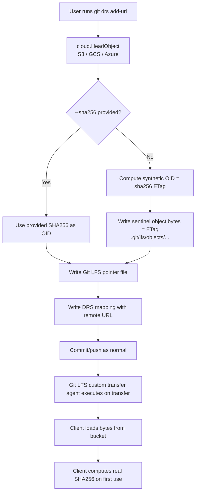

# ADR-0001: `add-url` Sentinel Design for Cloud Bucket References

- **Status:**   (Experimental)
- **Date:** 2026-03-26
- **Deciders:** Git DRS maintainers
- **Related code:** `cmd/addurl/*`, `cloud/head.go`

## Context

The `git drs add-url` command was expanded from a narrowly scoped S3-only path into a generalized cloud URL ingestion workflow. The current implementation inspects object metadata via provider-specific HEAD (or equivalent) calls and then writes a local Git LFS pointer plus DRS mapping without downloading file payload bytes.

This design exists to support "reference-style" registration of externally hosted data in cloud buckets where data movement is expensive or undesired.

The design also intentionally aligns with the **Git LFS custom transfer agent** architecture used by Git DRS. `add-url` prepares pointer/mapping state so that later transfer operations can resolve and hydrate through the existing custom-transfer path instead of requiring a full data copy during registration.

## Decision

We intentionally keep `add-url` **experimental** and **not intended for production-critical workflows** at this stage.

### 1) Experimental scope and responsibilities

`add-url` now collects bucket object metadata from:

- **S3** (`s3://...`, S3 HTTPS forms)
- **Google Cloud Storage** (`gs://...`, `storage.googleapis.com/...`)
- **Azure Blob Storage** (`az://...`, `https://<account>.blob.core.windows.net/...`)

The command records metadata and writes a Git LFS pointer, but it does **not** ingest data bytes into local LFS content storage as the canonical file.

Instead, the **client is responsible for loading data directly from the underlying bucket** during first real data access.

### 2) Sentinel data based on bucket HEAD-derived ETag

When `--sha256` is not supplied, `add-url` computes a synthetic OID as:

- `computed_oid = sha256(<etag string>)`

It then writes a local object at the LFS object path containing sentinel bytes (the ETag string itself). This allows Git LFS plumbing to see an object where expected while avoiding immediate full-object download.

In effect, this uses sentinel content to satisfy local Git LFS shape/expectations while deferring true content validation and hydration.

### 3) Real SHA256 deferred to first-use by client

The command's synthetic OID is an implementation convenience, not proof of file-content integrity.

The **real content SHA256 must be computed by the client on first use** (i.e., when actual bytes are fetched/streamed from cloud storage) and then treated as the authoritative checksum for integrity-sensitive operations.

### 4) LFS custom transfer agent remains the hydration path

`add-url` is a registration path, not a replacement transfer mechanism. The custom transfer agent remains the component responsible for runtime materialization and data movement behavior:

- `add-url` creates pointer + DRS mapping state.
- normal Git/Git LFS operations invoke custom transfer.
- custom transfer resolves remote metadata/URLs and performs actual byte movement as needed.

This keeps `add-url` lightweight while preserving consistency with existing Git DRS transfer behavior.

## Flow diagram

## Consequences

### Positive

- Avoids immediate full data transfer during `add-url`.
- Allows low-latency registration of bucket-hosted objects.
- Supports multi-cloud bucket metadata discovery via a common flow.

### Negative / Risks

- Synthetic OID can be confused with true content digest if callers are not explicit.
- ETag semantics vary across providers/configurations (multipart uploads, encryption modes, transformations), so ETag-derived values are not universally content hashes.
- Tooling assumptions that all LFS OIDs are true file SHA256 values do not hold for this path.
- If consumers bypass the custom transfer path, first-use checksum correction/hydration guarantees may not be applied consistently.

## Guardrails

- Treat `add-url` as experimental, with explicit user-facing caveats.
- Preserve ability to pass `--sha256` when authoritative content hash is already known.
- Document that first-use client download must compute and persist/propagate true SHA256 metadata.

## Rejected alternatives

1. **Always require explicit `--sha256` and fail otherwise.**
   - Rejected because many reference workflows know location before checksum.

2. **Always download full object at `add-url` time to compute true SHA256.**
   - Rejected due to cost/latency and because it defeats the primary goal of reference-style registration.

3. **Store only pointer metadata and no local LFS object artifact.**
   - Rejected because existing Git LFS expectations are easier to satisfy with a sentinel object layout.

## Rollout / follow-up

- Keep this behavior behind clear documentation and release notes indicating experimental status.
- Add/expand end-to-end tests for provider ETag corner cases.
- Define an explicit metadata field/state to distinguish synthetic OID from validated content SHA256.
