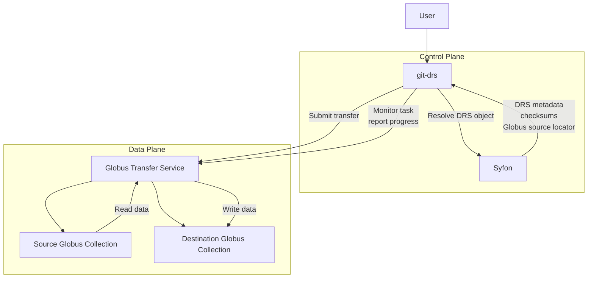
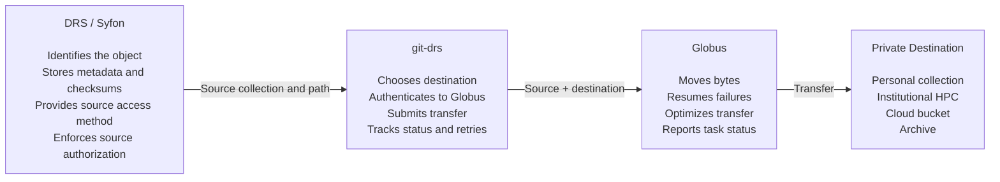
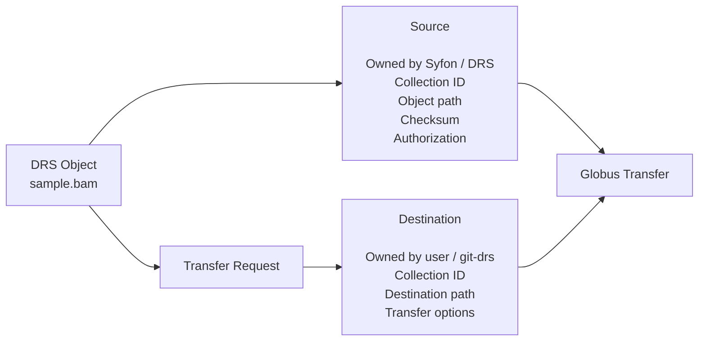
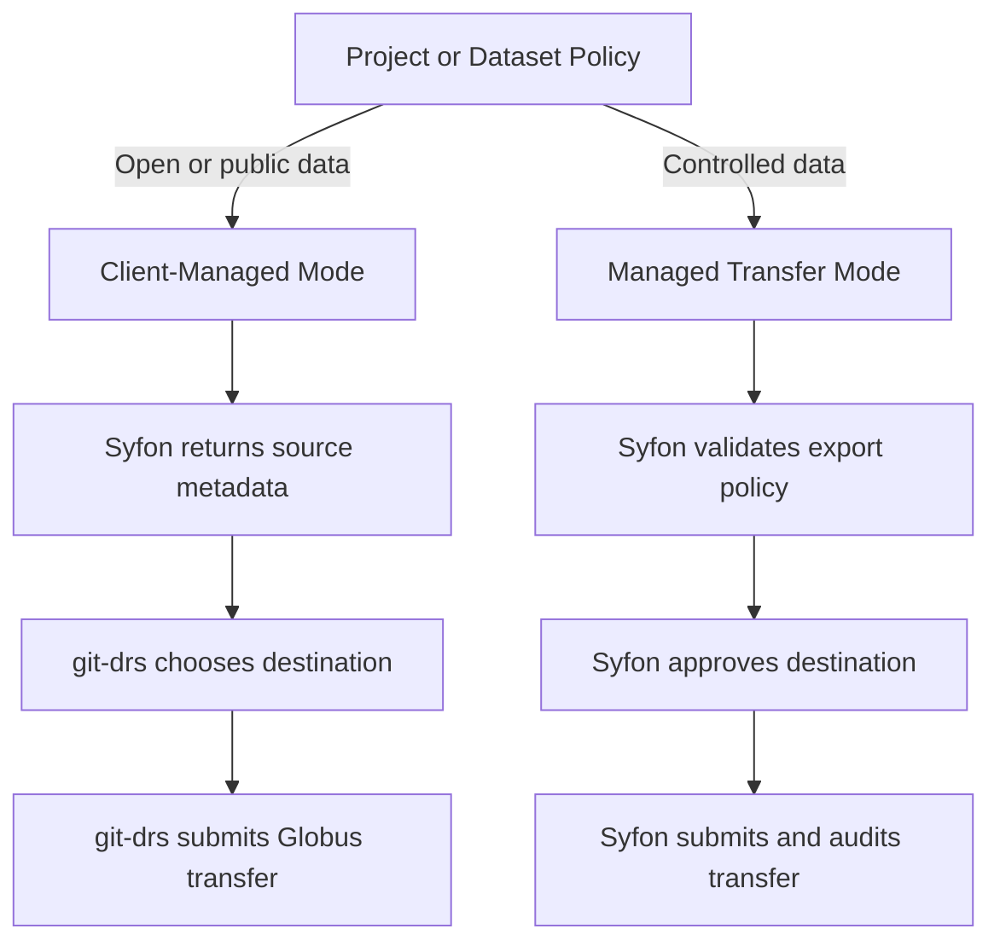
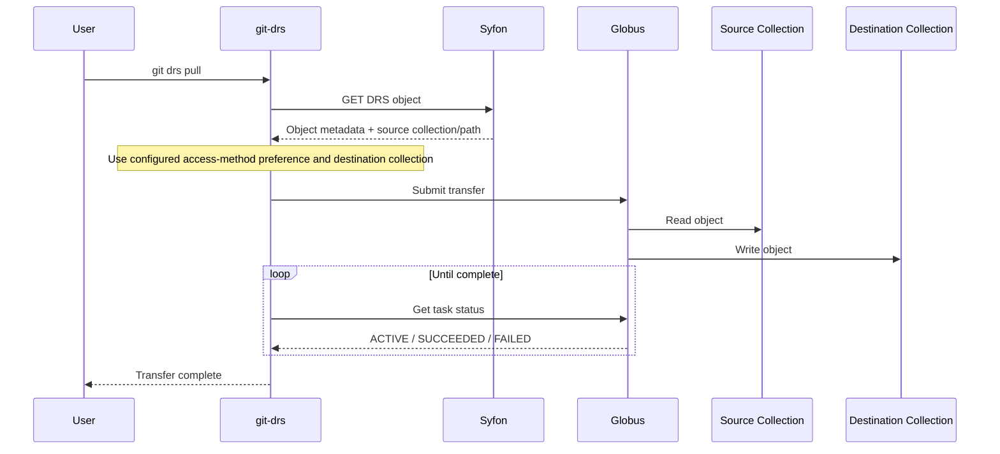

Below is a condensed one-page summary that captures what I think are the key architectural decisions, tradeoffs, and next steps from our discussions. It also incorporates the evolution from the original **server-managed** model to the **metadata-first, client-managed** alternative. This summary is based on the uploaded notes.

---

# DRS + Globus Integration Architecture (Summary)

## Vision

Integrate **Globus** with **Syfon** and **git-drs** while preserving the separation of responsibilities between **metadata**, **transport**, and **version control**.

**Guiding Principle**

* **DRS identifies data**
* **Globus transports data**
* **git-drs orchestrates the user workflow**
* **Git manages repository history**

---

## Component Responsibilities

| Component   | Responsibility                                                                                             |
| ----------- | ---------------------------------------------------------------------------------------------------------- |
| **Syfon**   | DRS metadata, authentication, authorization, object discovery, checksums, access methods                   |
| **git-drs** | User interface, transfer provider selection, destination selection, transfer execution, progress reporting |
| **Globus**  | High-performance transfer between Globus Collections                                                       |
| **DRS**     | Describes *where* data can be accessed, not *where it should be copied*                                    |
| **Git**     | Source code, pointer files, repository history                                                             |

---

## Recommended Client-Managed Architecture

The preferred architecture keeps Syfon focused on being an excellent DRS implementation while allowing `git-drs` to act as the transfer client.

```text
                   Metadata
              +----------------+
              |     Syfon      |
              |  DRS Records   |
              +----------------+
                      │
              DRS Access Methods
                      │
                      ▼
               +---------------+
               |    git-drs    |
               | Transfer Client|
               +---------------+
                 │     │      │
                 │     │      │
             Globus    S3   HTTPS
                 │
                 ▼
          User Destination
```

In this model:

* Syfon never manages transfer jobs.
* git-drs retrieves the source location from DRS.
* git-drs determines the destination.
* Globus performs the transfer directly.

---

## DRS + Globus Model

DRS explicitly supports **`globus`** as an `AccessMethod.type`.

A DRS object can advertise multiple access mechanisms:

* HTTPS
* S3
* Globus
* htsget

For Globus, Syfon should expose a locator similar to:

```
globus://<collection-id>/<path>
```

or equivalent structured metadata.

The DRS server knows:

* source collection
* source path

The client supplies:

* destination collection
* destination path, derived directly from the repository-relative LFS cache path

This cleanly separates metadata from transfer.

The destination collection root exposes the Git repository. `git-drs` converts
the local `.git/lfs/objects/...` cache path to a collection-absolute
`/.git/lfs/objects/...` destination path; it does not maintain a separate Globus
path prefix or local-root mapping.

---

## Why the Destination Belongs to the Client

The source is a property of the object.

The destination is a property of the transfer request.

The same DRS object may be copied to:

* personal workstation
* institutional HPC
* cloud storage
* archive
* another DRS repository

Therefore DRS should never encode the destination.

---

## Server vs Client Managed Transfers

| Area                   | Server Managed | Client Managed |
| ---------------------- | -------------- | -------------- |
| Syfon complexity       | High           | Low            |
| Operational visibility | Excellent      | Limited        |
| OAuth management       | Centralized    | Distributed    |
| Policy enforcement     | Strong         | Limited        |
| Deployment complexity  | Higher         | Lower          |
| User privacy           | Lower          | Higher         |
| Extensibility          | Moderate       | High           |

The client-managed model aligns naturally with the DRS specification, while the server-managed model is better suited to environments requiring centralized governance.

---

## Policy Considerations

### Client-managed works well for

* Public datasets
* Open science
* Personal repositories
* Research collaboration
* Developer workflows

### Server-managed may be required for

* AnVIL
* dbGaP
* HIPAA
* Clinical repositories
* Controlled-access NIH datasets

Reasons include:

* export restrictions
* approved destination enforcement
* auditing
* compliance reporting

---

## Primary Risks

### Governance

* Data Use Agreements
* export restrictions
* approved destinations
* institutional policies

### Security

* OAuth tokens
* service credentials
* secret leakage
* identity federation

### Operations

* retries
* checksum verification
* replica lifecycle
* transfer monitoring

---

## Recommended Development Roadmap

1. Expose Syfon data as Globus access methods.
2. Build a local development environment using:

    * Syfon
    * MinIO
    * Globus Connect Server (source)
    * Globus Connect Personal (destination)
3. Implement a standalone Globus transfer client.
4. Add Globus support to `git-drs`.
5. Evaluate whether server-side orchestration is needed for controlled-access deployments.

---

## Long-Term Direction

Support both deployment models:

* **Metadata Mode** (default)

    * Syfon provides DRS metadata only.
    * git-drs manages transfers.

* **Managed Mode** (optional)

    * Syfon orchestrates and audits transfers.
    * Required for environments with strict governance.

This allows Syfon to remain lightweight while supporting more restrictive deployments when policy requires it.

## Architecture Overview

```text
                     +-------------------------+
                     |        Syfon            |
                     |-------------------------|
                     | • DRS Metadata          |
                     | • AuthN/AuthZ           |
                     | • Checksums             |
                     | • Access Methods        |
                     | • Source Collection Map |
                     +-----------+-------------+
                                 |
                   DRS Access Method (globus://...)
                                 |
                                 v
                     +-------------------------+
                     |       git-drs           |
                     |-------------------------|
                     | • Resolve DRS Object    |
                     | • Select Provider       |
                     | • Choose Destination    |
                     | • Authenticate Globus   |
                     | • Execute Transfer      |
                     | • Progress & Retries    |
                     +-----------+-------------+
                                 |
                    Globus Transfer API / S3 / HTTPS
                                 |
                                 v
        +------------------------+------------------------+
        |                                                 |
+------------------------+                  +--------------------------+
| Source Globus          |                  | Destination Globus       |
| Collection             |  ==========>     | Collection               |
| (mapped from Syfon)    |    Transfer      | (chosen by user/client)  |
+------------------------+                  +--------------------------+
```

This figure illustrates the central architectural insight from the design discussions: **Syfon owns knowledge of the source object, `git-drs` owns knowledge of the destination, and Globus performs the data movement between the two.**

----
Here are improved Mermaid figures you can drop directly into the one-page summary.

## Recommended Client-Managed Architecture



## Roles and Responsibilities



## Source and Destination Ownership



## Policy-Driven Deployment Modes



## End-to-End Client Workflow



The first figure is the strongest primary diagram for the one-page summary. The sequence diagram works well as a secondary implementation figure.

## Globus access URLs

git-drs can hydrate objects whose DRS access URL uses the Globus transport form:

```text
globus://<collection-id>/<path>
```

Syfon owns the source collection and object path in the DRS access method. The client supplies the destination collection and path for the local checkout/cache transfer.

Before pulling Globus-backed objects:

1. Set `GIT_DRS_GLOBUS_CLIENT_ID` to a registered native application client ID, run `git drs auth globus login`, and request any collection-specific `data_access` dependent scopes with `--scope`. Automation may instead set `GIT_DRS_GLOBUS_TRANSFER_TOKEN`.
2. Set `GIT_DRS_GLOBUS_DESTINATION_COLLECTION` to the destination collection that is visible from your local environment, such as a Globus Connect Personal collection.
3. Configure the destination collection root to expose the repository root so transfers write directly to `.git/lfs/objects`.
4. If a DRS object advertises multiple access methods and you prefer Globus, set `GIT_DRS_ACCESS_METHOD=globus` (or `GIT_DRS_TRANSFER_PROVIDER=globus`).

When git-drs receives a `globus://` access URL, it loads and refreshes the stored Globus credential, verifies Transfer API authentication with the same check used by `git drs auth globus status`, requests a submission ID, submits a transfer task to the Globus Transfer API, polls task status until completion, and then validates the hydrated cache object using the normal size/checksum checks.
