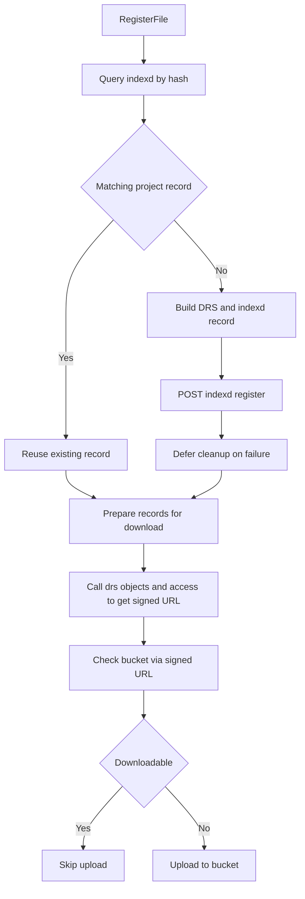
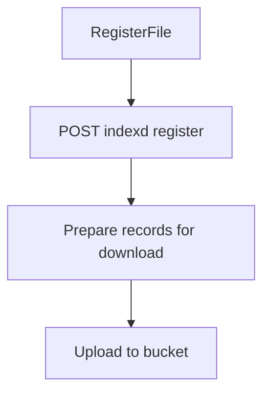
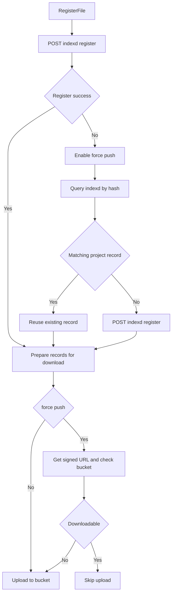

# ADR 0001: Configure RegisterFile upsert/bucket checks via git LFS config

## Status
Accepted

## Context
The Indexd `RegisterFile` flow needs toggles for:
- whether to upsert indexd records (create when no matching project record exists, or replace by deleting and re-registering when a ma
- whether to check bucket existence before uploading (Unimplemented, currently always checks and skips upload if already present)

These toggles must be controlled per-repository using git LFS configuration (`git config` entries under `lfs.customtransfer.drs.*`). This keeps behavior in repo-local configuration and avoids coupling to remote YAML configuration.

## Decision
Read `lfs.customtransfer.drs.upsert` from git config during Indexd client initialization. Missing values default to `false`. Invalid values fail initialization with a clear error.

## Before

## After

### fresh (no existing record)

### force (retry on indexd register error)

## Consequences
- Operators can control behavior using `git config` without editing remote YAML.
- Defaults remain disabled when keys are missing.
- Misconfigured values fail fast during initialization.
