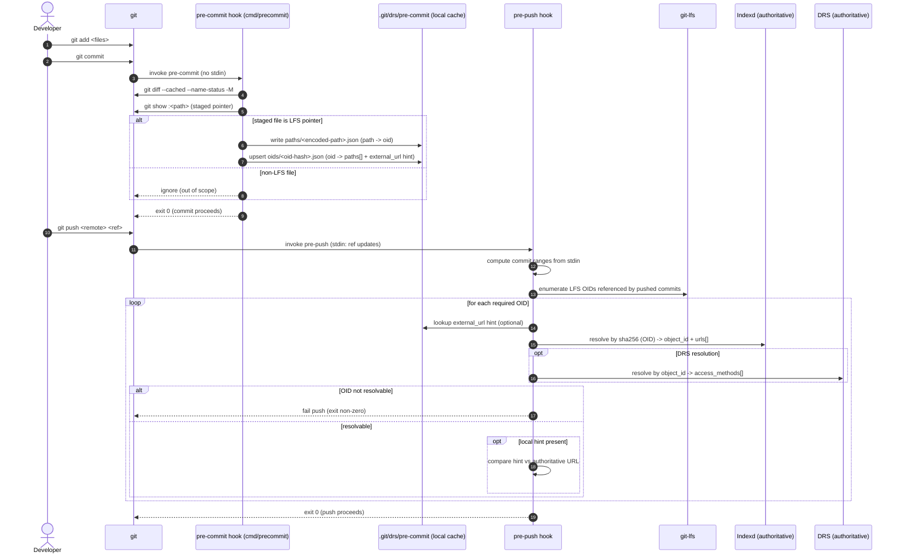

Below is **developer-facing documentation** you can drop into your repo (e.g. `docs/precommit-cache.md` or `README-precommit.md`).
It assumes:

* `cmd/precommit` installs the **pre-commit hook**
* `precommit_cache` is the **read-only helper library** used by pre-push (and other tooling)

---

# Developer Documentation: `.git/drs/pre-commit` Cache & Helpers

## Overview

This repository uses a **local, non-versioned cache** under:

```
.git/drs/pre-commit/
```

to support fast, offline-friendly workflows for **Git LFS–tracked files**.

The cache is:

* **LFS-only**
* **non-authoritative**
* **local to a working copy**
* **never committed to Git**

Its sole purpose is to bridge the gap between:

* **pre-commit** (file / path / content–centric, no network)
* **pre-push** (ref / commit-range–centric, authoritative server resolution)

> **Crisp rule:**
> **Path is never authoritative; OID (sha256) is.**

---

## Responsibilities by Component

### `cmd/precommit` (pre-commit hook)

* Runs on every `git commit`
* Reads **staged content only**
* Updates `.git/drs/pre-commit` cache
* Never performs network I/O
* Never queries Indexd or DRS
* Ignores all non-LFS files

### `precommit_cache` (helper library)

* Read-only access to `.git/drs/pre-commit`
* Used primarily by **pre-push**
* Provides:

    * path → OID lookups
    * OID → paths lookups (advisory)
    * OID → external URL hints
* Does **not** modify cache contents

---

## Cache Scope (Important)

Only files whose **staged content** is a valid Git LFS pointer are in scope:

```
version https://git-lfs.github.com/spec/v1
oid sha256:<hex>
```

Everything else is ignored.

This is by design.

---

## Cache Location & Versioning

All cache data lives under:

```
.git/drs/pre-commit/v1/
```

* Versioned by directory (`v1/`) to allow future format evolution
* Safe to delete at any time (will be rebuilt)

---

## Directory Layout

```
.git/drs/pre-commit/
  v1/
    paths/
      <encoded-path>.json
    oids/
      <oid-hash>.json
    tombstones/
      <encoded-path>.json   (optional / best-effort)
    state.json              (reserved for future use)
```

---

## Data Model

The cache models **three non-authoritative relationships**:

1. **Path → OID**
2. **OID → Path(s)**
3. **OID → External URL (hint)**

All are **hints only**.
The authoritative source of truth lives on the server (Indexd / DRS).

---

## File Formats

### Path Entry

`v1/paths/<encoded-path>.json`

Represents the **currently staged** LFS object at a given working-tree path.

```json
{
  "path": "data/foo.bam",
  "lfs_oid": "sha256:abc123...",
  "updated_at": "2026-02-01T12:34:56Z"
}
```

Notes:

* `path` is repo-relative
* `lfs_oid` comes from the staged LFS pointer
* Updated on:

    * add
    * modify
    * rename
    * undo / restage

---

### OID Entry

`v1/oids/<oid-hash>.json`

Represents **advisory information** about an LFS object.

```json
{
  "lfs_oid": "sha256:abc123...",
  "paths": [
    "data/foo.bam",
    "data/archive/foo-copy.bam"
  ],
  "external_url": "s3://bucket/key",
  "updated_at": "2026-02-01T12:34:56Z",
  "content_changed": false
}
```

Notes:

* `paths[]` is advisory and may contain stale values
* `external_url` is a **hint**, not authoritative
* `content_changed` reflects local observation only

---

### Tombstones (Optional)

Used to record deleted paths for potential GC or debugging.

```json
{
  "path": "data/old.bam",
  "deleted_at": "2026-02-01T12:00:00Z"
}
```

---

## Pre-Commit Behavior (What Happens Automatically)

### Add / Modify LFS File

* Extracts LFS OID from staged pointer
* Updates:

    * `paths/<path>.json`
    * `oids/<oid>.json`
* Preserves any existing `external_url` hint

### Rename / Move LFS File

* Moves `paths/<old>.json` → `paths/<new>.json`
* Updates OID entry paths list
* OID remains unchanged

### Content Change

* Detects OID change for same path
* Updates path entry with new OID
* Marks `content_changed=true` on new OID entry
* Removes path from old OID entry (best-effort)

### Undo / Reset / Restage

* No special handling
* Cache always reconciles from the staged index
* Stale entries are tolerated

---

## What the Cache Is *Not*

* ❌ Not authoritative
* ❌ Not guaranteed to be complete
* ❌ Not synced across machines
* ❌ Not committed to Git
* ❌ Not validated against server state

It exists purely to improve developer ergonomics.

---

## `precommit_cache` Helper Library

### Package Purpose

`precommit_cache` provides **read-only helpers** for consumers such as:

* `pre-push` hooks
* diagnostic tools
* developer utilities

It never mutates cache state.

---

### Opening the Cache

```go
cache, err := drscache.Open(ctx)
if err != nil {
    // handle error
}
```

This locates `.git/drs/pre-commit/v1` automatically.

---

### Common Lookups

#### Path → OID

```go
oid, ok, err := cache.LookupOIDByPath("data/foo.bam")
```

* `ok=false` means no cache entry
* Does not guarantee the file is still staged

---

#### OID → Paths (Advisory)

```go
paths, ok, err := cache.LookupPathsByOID(oid)
```

Useful for:

* error messages
* diagnostics
* explaining why an OID is required at push time

---

#### OID → External URL Hint

```go
url, ok, err := cache.LookupExternalURLByOID(oid)
```

* Hint only
* May be stale or missing
* Must be validated against Indexd / DRS

---

#### Path → External URL Hint

```go
url, ok, err := cache.ResolveExternalURLByPath("data/foo.bam")
```

Convenience helper:

```
path → oid → external_url
```

---

### Validation Helpers

```go
err := drscache.CheckExternalURLMismatch(localHint, authoritativeURL)
```

Used by pre-push to compare local hints with server truth.

---

## Intended Pre-Push Usage Pattern

1. Determine commit range from pre-push stdin
2. Enumerate **LFS OIDs** referenced by pushed commits
3. For each OID:

    * Optionally read local hints from `precommit_cache`
    * Resolve authoritative data from Indexd / DRS
4. Enforce policy:

    * unresolved OID → fail push
    * mismatched external URL → warn or fail
5. Proceed with push

---

## Deleting or Rebuilding the Cache

It is always safe to delete:

```
rm -rf .git/drs/pre-commit
```

The cache will be rebuilt automatically on the next commit.

---

## Design Guarantees

* Pre-commit remains:

    * fast
    * deterministic
    * offline-friendly
* Pre-push remains:

    * authoritative
    * ref-aware
    * network-enabled
* Git history remains:

    * clean
    * storage-agnostic
    * reproducible via server index

---

## Sequence Diagram



## Summary

> `.git/drs/pre-commit` is a **local, LFS-only, non-authoritative cache** that tracks
> **path ↔ OID ↔ external URL hints** to support rename, undo, and offline workflows.
>
> `precommit_cache` provides safe, read-only access to this cache for enforcement at pre-push.

If you want, I can also:

* add **inline Go doc comments** suitable for `pkg.go.dev`
* generate a **sequence diagram** (commit → cache → push → Indexd/DRS)
* or write a **pre-push reference implementation** that uses these helpers end-to-end
