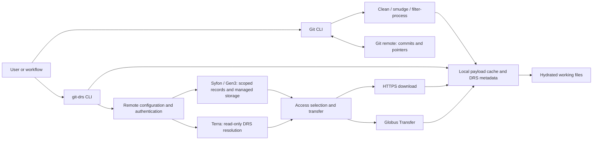

# Git DRS walkthrough

A presentation of use cases, architecture, implementation, and a hands-on tutorial.
Written for researchers, data stewards, and developers using this checkout.
Sections separated by horizontal rules can be presented as individual slides.

## 1. What Git DRS does

`git-drs` lets a Git repository describe a dataset while the large files live
in managed storage or remain at their original source. Git commits contain small
pointers; users download the corresponding bytes when needed.

Think of it as the Git LFS model applied to DRS-backed data: both keep small
pointers in Git and large file contents outside Git history. Git LFS retrieves
those contents through an LFS server; `git-drs` uses DRS metadata and access
methods to retrieve them from managed storage or existing sources such as Globus
collections and AnVIL. The familiar workflow remains: version the reference,
then materialize the file when an analysis needs it.

- **Git** versions paths, pointers, code, and analysis configuration.
- **DRS (Data Repository Service)** identifies objects and resolves access.
- **Storage and transfer services** hold and deliver the bytes.

The writable workflow targets Syfon and uses extensions for operations such
as bulk lookup and registration. It is not a universal, pure GA4GH DRS client.
Terra provides a separate read-only workflow for existing AnVIL references.

---

## 2. Use cases

| User and goal | Workflow | What gets published |
| --- | --- | --- |
| Researcher sharing newly generated results | Track local files, commit, then `git drs push` | Git pointers, scoped DRS records, and missing payloads |
| Steward cataloging existing bucket objects | `git drs add-url`, commit, then managed push | References and metadata without re-uploading existing bytes |
| Team referencing a Globus collection | Import a directory or quoted wildcard with `add-url` | Explicit pointers for the selected members |
| Analyst using controlled AnVIL data | `git drs add-ref` through Terra, then ordinary `git push` | Git pointers preserving canonical DRS URIs |
| Collaborator reproducing an analysis | Clone, configure access, selectively `git drs pull` | Local hydrated files; Git history keeps pointers |

A commit fixes the reference layout. Reproducing the bytes also depends on source
retention and access permissions. A real content checksum provides stronger
identity than a mutable provider location alone.

---

## 3. Four commands to distinguish

| Command | Responsibility |
| --- | --- |
| `git pull` | Update Git history and the checkout |
| `git drs pull` | Hydrate tracked pointers already in the checkout |
| `git push` | Publish Git refs and pointer text |
| `git drs push` | Synchronize writable DRS metadata/payloads, push Git refs, then acknowledge synchronization |

For writable DRS data, use managed push to make the referenced objects
available. For read-only DRS references, use ordinary Git push: managed push
refuses that provider.

> **Sidebar: DRS write capabilities are needed for managed push, not for reading.**
>
> `git drs push` requires a compatible writable DRS provider with object
> registration and upload support, plus the user's permission to write. The
> current writable adapter targets [Syfon](https://github.com/calypr/syfon), a DRS implementation backed by Gen3's Fence auth system. A server offering DRS read
> endpoints alone cannot support that managed push workflow.
>
> Relevant schema work includes [PR #416: DRS write support](https://github.com/ga4gh/data-repository-service-schemas/pull/416)
> and [PR #418: Optional DRS upload, update & delete extensions](https://github.com/ga4gh/data-repository-service-schemas/pull/418).
> These cover object creation/upload and optional lifecycle operations;
> #418 explicitly preserves compliance for servers that omit those extensions.
>
> **Git DRS remains useful without DRS write support.** With a supported read
> provider such as Terra, use `git drs add-ref` to create references to existing
> objects, commit and publish the pointers with ordinary `git push`, and use
> `git drs pull` to hydrate them with each reader's own data-access credentials.
> This workflow neither uploads payloads nor creates or modifies source DRS
> records.

---

## 4. Architecture



The Git remote and DRS remote are separate services. In the current managed
push implementation, the selected remote name is also passed to `git push`.
Configure both under the same name, such as `origin`.

The selected DRS remote supplies repository scope and provider behavior. A
reference to another DRS authority retains its source identity; the primary
remote is not a general proxy for every source authority.

---

## 5. Where state lives

| Location | Contents | Shared by a Git clone? |
| --- | --- | --- |
| Git commits and index | Pointer text and ordinary versioned files | Yes |
| `.gitattributes` | Tracking/filter rules | Yes, when committed |
| Working tree | Pointers or hydrated payloads | Recreated during checkout/hydration |
| `.git/config` | Local remote configuration and checkout policy | No |
| `.git/lfs/objects` | Cached payload bytes | No |
| `.git/drs/lfs/objects` | Authoritative local DRS object metadata | No |
| `.git/drs/pre-commit` | Rebuildable bookkeeping cache | No |
| DRS service and provider storage | Shared object records and payloads | Accessed separately |

Credentials belong in local credential sources, not committed files. A Git clone
does not grant data access. Each collaborator configures their own credentials
and remote settings.

---

## 6. Pointer identity

A normal locally tracked file uses its content SHA-256:

```text
version https://git-lfs.github.com/spec/v1
oid sha256:<content-sha256>
size <bytes>
```

A DRS reference can preserve its source URI directly:

```text
version https://calypr.github.io/spec/v1
oid drs://<authority>/<object-id>
size <bytes>
```

Terra references preserve the canonical DRS URI even when a SHA-256 is available.
Other reference paths can use a real SHA-256 when the source supplies one.

Provider imports without a known SHA-256 use a marked placeholder:

```text
version https://git-lfs.github.com/spec/v1
ext-0-gitdrsplaceholder sha256:<derived-local-oid>
oid sha256:<derived-local-oid>
size <bytes>
```

That derived OID is a cache/source identifier, not a content checksum. For Globus,
it incorporates the member URL, size, and modification time. Temporary download
URLs and access tokens are not durable pointer identities.

**Why SHA-256 is ultimately required for LFS-style content identity.** Git DRS
inherits Git LFS's content-addressed model: an ordinary LFS pointer identifies
the actual file bytes by their SHA-256, the only object-hash algorithm supported
by the [Git LFS pointer specification](https://github.com/git-lfs/git-lfs/blob/main/docs/spec.md#the-pointer).
That checksum lets the client recognize identical content across paths or storage
locations and verify that downloaded or cached bytes match the expected object.
A URI, file size, or modification time alone cannot provide that assurance.

Reference-first workflows can defer computing SHA-256 until bytes are available;
they do not require downloading an entire dataset just to commit references.
To gain the same content-verification guarantee, however, a real SHA-256 must
eventually be supplied by a trusted source or computed from the payload. A hash
learned on first download establishes a baseline for subsequent checks; it does
not independently prove that the first download matched the originally intended
content. DRS URI pointers can retain their URI while the checksum lives in DRS
metadata—there is no need to rewrite their committed identity.

---

## 7. Implementation: track, commit, and push

1. `git drs track` writes `.gitattributes` rules.
2. During `git add`, the clean filter streams the payload through SHA-256,
   stores it in the local payload cache, and emits a pointer into the Git index.
3. Git commits the pointer while the worktree can retain the original bytes.
4. Managed push discovers pointers in reachable Git history, subtracting the
   history covered by the remote `refs/git-drs/synced/*` acknowledgment.
5. Syfon negotiation identifies missing scoped metadata and payloads. Existing
   provider references can be registered without copying their bytes.
6. After data synchronization, the command pushes the branch and advances the
   acknowledgment. Missing historical payloads are reported and prevent the
   acknowledgment from advancing.

The pre-commit hook performs local bookkeeping; remote registration does not
depend on that cache. Removing a pointer from the branch tip does not implicitly
delete payloads still referenced by historical commits.

---

## 8. Implementation: reference and hydrate

`add-ref` resolves DRS metadata; `add-url` inspects existing provider objects.
Both create local pointers and metadata before any later managed registration.
Globus directory imports freeze the selected member URLs; subsequent pulls do
not re-run the wildcard against a changing collection.

During pull, the client:

1. Selects tracked paths, applying any include patterns.
2. Uses cached content or resolves the relevant DRS/source metadata.
3. Selects an available access method and resolves access URLs as needed.
4. Downloads into the payload cache, validates available integrity information,
   and hydrates the working files.

Automatic access selection prefers HTTPS, then Globus among implemented transfer
handlers. `--access-method globus` is a strict requirement;
`GIT_DRS_ACCESS_METHOD=prefer:globus` permits fallback during planning.
Fallback stops once a byte request or Globus task has started.

For checksum-less Globus imports, initial hydration checks size and uses Globus
transfer verification. It also records the learned SHA-256 locally. A later
explicit managed push publishes that refinement.

---

## 9. Implementation map

The CLI is written in Go and uses Cobra. Git operations combine Git subprocesses
with repository helpers; provider clients handle remote APIs.

| Source | Responsibility |
| --- | --- |
| [`../cmd/remote/add`](../cmd/remote/add/) | Provider selection, credentials, and repository bootstrap |
| [`../internal/config`](../internal/config/) / [`../internal/remoteruntime`](../internal/remoteruntime/) | Persisted settings and live provider clients |
| [`../internal/filter`](../internal/filter/) | Clean, smudge, and filter-process protocol |
| [`../internal/lfs`](../internal/lfs/) | Pointer parsing, cache paths, and Git-history inventory |
| [`../internal/drsobject`](../internal/drsobject/) | Local DRS metadata persistence |
| [`../cmd/push`](../cmd/push/) / [`../internal/transfer`](../internal/transfer/) | Managed synchronization, transfer, and progress |
| [`../cmd/pull`](../cmd/pull/) | Hydration orchestration |
| [`../cmd/addref`](../cmd/addref/) / [`../cmd/addurl`](../cmd/addurl/) | Reference creation and provider import |
| [`../internal/resolver`](../internal/resolver/) / [`../internal/lookup`](../internal/lookup/) | Source resolution and scoped object lookup |
| [`../internal/globusauth`](../internal/globusauth/) | Globus authorization and token refresh |

Start a code walkthrough with `../internal/filter/clean.go`, then
`cmd/push/main.go` and `cmd/push/sync_refs.go`, followed by `cmd/pull/main.go`.

---

## 10. Tutorial: prerequisites

The main tutorial uploads a tiny TSV through a writable Syfon deployment,
then hydrates it in a second clone. It requires:

- Git and a `git-drs` binary on `PATH`; see [installation](installation.md).
- An empty writable Git repository, with permission to push branch and
  `refs/git-drs/synced/*` refs.
- A writable Syfon endpoint and an authorized `organization/project` scope.
- Server-side bucket mapping provisioned for that scope by a steward.
- A Gen3 credential file stored outside the repository.

To build this checkout instead of installing a release, use the Go version in
[`../go.mod`](../go.mod) (currently `1.26.4`):

```bash
# From the git-drs source directory:
go build -o /tmp/git-drs .
export PATH="/tmp:$PATH"
git drs version
git drs install
```

`install` writes global Git filter settings. The following tutorial commands
create demo repositories and publish demo data. Replace all `<...>` placeholders
before running them; execute each block only after the preceding block succeeds.

---

## 11. Tutorial: configure the producer

```bash
mkdir git-drs-walkthrough
cd git-drs-walkthrough
git init -b main
git remote add origin '<git-repository-url>'
git drs remote add origin 'https://<gen3-host>' \
  --provider gen3 --scope '<organization/project>' \
  --auth provider-helper:gen3-profile \
  --credential 'file:/absolute/path/to/credentials.json' \
  --checkout pointers
git drs remote list
git drs ping origin
```

`remote add` bootstraps repository-local Git DRS state. Both remotes are named
`origin` so managed push can synchronize DRS and then publish to the Git host.
The Git host URL and DRS endpoint can be entirely different servers.

---

## 12. Tutorial: create and inspect a pointer

```bash
mkdir data
printf 'sample\tvalue\nsample-1\t42\n' > data/results.tsv
git drs track 'data/*.tsv'
git add .gitattributes data/results.tsv
git commit -m 'Add walkthrough results'
git show HEAD:data/results.tsv
cat data/results.tsv
git drs ls-files
```

Expected observations:

- `git show` displays a small LFS-compatible pointer with SHA-256 and size.
- `cat` displays the original two-line TSV in the worktree.
- `ls-files` lists the tracked file; `*` indicates hydrated content and `-`
  indicates pointer-only worktree state.

This is the core demonstration: Git history contains the reference while the
working file remains usable by ordinary analysis tools.

---

## 13. Tutorial: synchronize and consume

Publish from the producer:

```bash
git drs push origin
git drs ls-files --drs
```

Managed push registers/uploads the object, pushes `main`, and updates the remote
synchronization acknowledgment. The inventory command adds DRS lookup details.

Create a fresh consumer clone to demonstrate retrieval without relying on the
producer's local payload cache:

```bash
cd ..
GIT_DRS_SKIP_SMUDGE=1 git clone --branch main \
  '<git-repository-url>' git-drs-consumer
cd git-drs-consumer
git drs remote add origin 'https://<gen3-host>' \
  --provider gen3 --scope '<organization/project>' \
  --auth provider-helper:gen3-profile \
  --credential 'file:/absolute/path/to/consumer-credentials.json' \
  --checkout pointers
git drs ls-files
git drs pull --dry-run -I 'data/*.tsv'
git drs pull -I 'data/*.tsv'
cat data/results.tsv
git status --short
```

The TSV should match the producer's contents, and hydration should leave no
tracked content changes. The consumer credential can belong to another person
with read access. On later visits, run `git pull` to update history, followed by
`git drs pull` for the desired payloads.

---

## 14. Tutorial extension: existing Globus data

Use the producer repository and its writable `origin` DRS scope. Before running
this extension, obtain a Globus native application client ID, access to the
source collection, and a writable destination collection exposing this checkout,
including its hidden `.git/lfs/objects` directory.

```bash
export GIT_DRS_GLOBUS_CLIENT_ID='<native-client-id>'
git drs auth globus login
export GIT_DRS_GLOBUS_DESTINATION_COLLECTION='<destination-collection-id>'
git config --local --add drs.remote.origin.globus-destination-path \
  '<destination-collection-id>=/collection/path/to/git-drs-walkthrough'

git drs add-url 'globus://<source-collection-id>/release/**/*.bam' \
  external/reads --dry-run
git drs add-url 'globus://<source-collection-id>/release/**/*.bam' \
  external/reads
git add .gitattributes external/reads
git commit -m 'Reference existing Globus reads'
git drs push origin
git drs pull -I 'external/reads/**'
git drs push origin
```

The first push registers references without uploading the Globus source bytes.
Pull transfers selected members into the local cache and hydrates the worktree.
The final push publishes checksums learned from placeholder hydration.

The destination mapping is the repository's path **as seen by the collection**,
which may differ from its local filesystem path. If consent is required, repeat
login with the scopes reported by Globus. See [Globus setup](globus.md)
and the [executable integration tutorial](../tests/globus-user-integration-test/README.md).

---

## 15. Tutorial extension: read-only AnVIL references

Use a separate repository and a DRS URI for a dataset your Google identity is
authorized to access. Install the Google Cloud CLI and configure local ADC.

```bash
gcloud auth application-default login
mkdir anvil-walkthrough
cd anvil-walkthrough
git init -b main
git remote add origin '<anvil-git-repository-url>'
git drs remote add anvil terra --checkout pointers
git drs add-ref --remote anvil \
  'drs://<authority>/<object-id>' data/sample.cram
git add .gitattributes data/sample.cram
git commit -m 'Reference AnVIL sample'
git show HEAD:data/sample.cram
git push -u origin main
git drs pull anvil -I 'data/*.cram'
```

The commit carries the canonical DRS reference. Ordinary Git push publishes it
without creating Terra records or uploading data. Pull uses the user's own ADC
and data permissions; downloaded read-only files are made read-only locally.

In another clone, independently authenticate, run
`git drs remote add anvil terra --checkout pointers`, and hydrate. Do not share
ADC files or commit signed download URLs. See [AnVIL usage](anvil.md).

---

## 16. Diagnostics and operational boundaries

| Symptom | First check |
| --- | --- |
| Pointer remains after `git pull` | Run `git drs pull`; Git history updates and hydration are separate |
| File absent from inventory | Inspect `.gitattributes` and confirm the pointer was staged/committed |
| Managed push cannot find Git remote | Match the Git and DRS remote names used by managed push |
| Upload or scoped lookup denied | Confirm identity, organization/project permission, and bucket mapping |
| Terra managed push rejected | Publish reference commits with ordinary `git push` |
| Globus reports path not allowed | Check destination mapping, collection availability, and hidden-directory access |
| Mixed-source pull rejects non-Globus objects | Remove strict `--access-method globus`, or use `prefer:globus` |

`git drs rm` removes tracked paths from the worktree and index. Commit and push
that change to update the dataset layout; historical object retention is
separate from deleting a path. Explicit remote deletion is destructive and is
outside this tutorial.

For exact options, use `git drs <command> --help` and the
[command reference](commands.md). For deeper investigation, see the
[developer guide](developer-guide.md),
[pointer lifecycle](pointer-files.md), and
[troubleshooting guide](troubleshooting.md).
